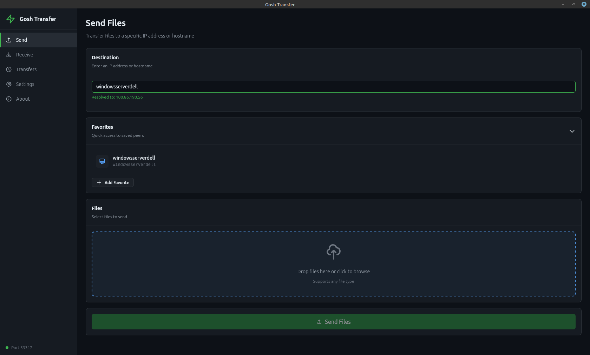
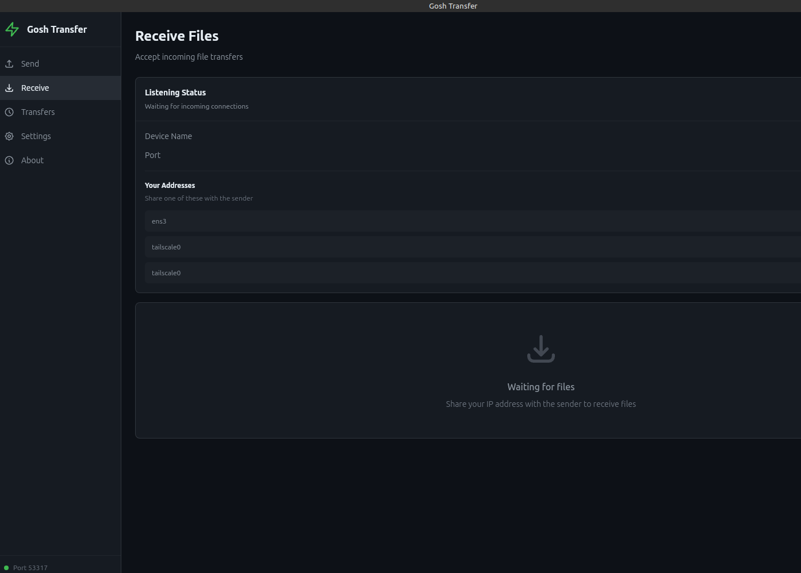
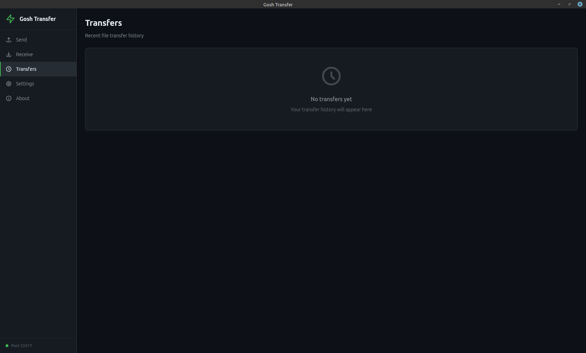
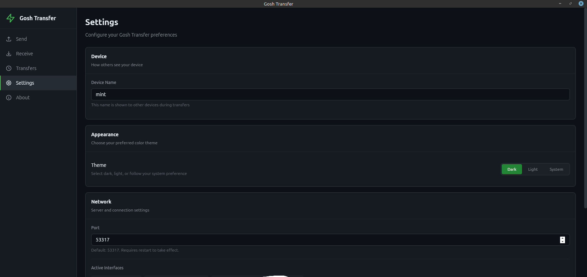
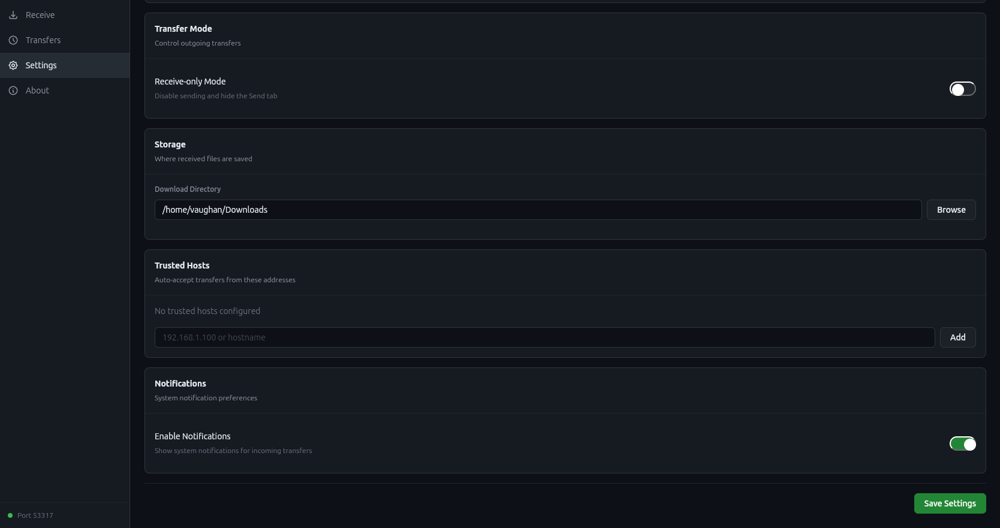

# Gosh Transfer

A cross-platform desktop application for explicit file transfers over LAN, Tailscale, and VPNs.

## What It Does

Gosh Transfer sends files and folders between computers using explicit IP addresses or hostnames. No auto-discovery, no cloud services—you specify exactly where files go.

Powered by [gosh-lan-transfer](https://github.com/goshitsarch-eng/gosh-lan-transfer), a standalone Rust library for peer-to-peer file transfers.

## Linux Version

Looking for a native Linux experience? Check out [Gosh Transfer Linux](https://github.com/goshitsarch-eng/gosh-transfer-linux), an independent GTK4/libadwaita implementation built specifically for Linux desktops. It shares the same transfer engine but offers a native GNOME-style interface.

## Screenshots







## Features

Send files or entire folders to any IP or hostname using drag and drop or the file picker. Incoming transfers require manual approval unless the sender is on your trusted hosts list. Save frequently used addresses as favorites for quick access. The app supports dark, light, and system themes, and can run in receive-only mode if you prefer.

Transfer progress shows real-time speed, and you can cancel transfers mid-flight. When multiple transfers arrive at once, batch accept or reject them all. System notifications alert you to incoming transfers even when the app is in the background.

## Architecture

This version uses Tauri 2 with a Rust backend and Svelte 5 frontend. The transfer engine ([gosh-lan-transfer](https://github.com/goshitsarch-eng/gosh-lan-transfer)) provides an Axum HTTP server for receiving and Reqwest for sending.

The application runs an HTTP server on port 53317 by default. Port changes take effect immediately without restarting.

### Network Protocol

| Endpoint | Method | Purpose |
|----------|--------|---------|
| `/health` | GET | Connectivity check |
| `/info` | GET | Returns device name and version |
| `/transfer` | POST | Initiate transfer request |
| `/transfer/status` | GET | Poll approval status |
| `/chunk` | POST | Stream file data |
| `/events` | GET | SSE for real-time progress |

### Data Storage

Settings, favorites, and transfer history are stored in the OS config directory:

| Platform | Location |
|----------|----------|
| macOS | `~/Library/Application Support/com.gosh.transfer/` |
| Windows | `%APPDATA%\gosh\transfer\config\` |
| Linux | `~/.config/com.gosh.transfer/` |

## Building

Requires Node.js 18+ and Rust 1.70+, plus platform-specific Tauri dependencies.

```bash
# Development
npm install
npm run tauri dev

# Production
npm run tauri build
```

## Known Limitations

The server binds to IPv4 only (`0.0.0.0`). Trusted hosts require exact IP matches; hostnames won't work unless previously resolved.

## Disclaimer

This application is an independent project, not sponsored by or affiliated with LocalSend or GitHub, Inc.

Licensed under AGPL-3.0. Provided "as is" without warranty. Use at your own risk.

## License

AGPL-3.0 — See [LICENSE](LICENSE)
